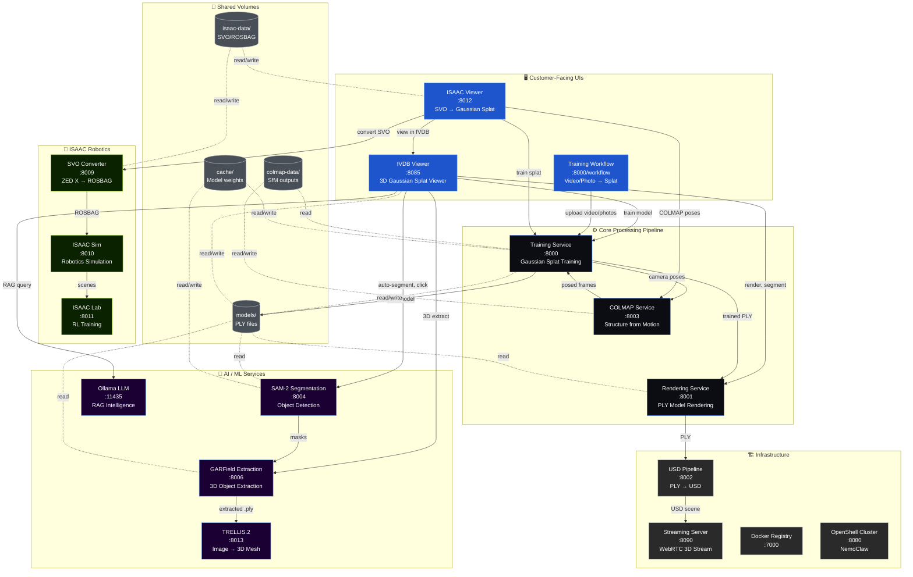
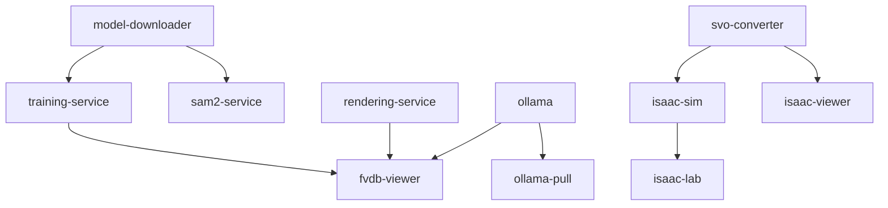

# fVDB Gaussian Splatting Platform - Multi-Container Architecture

## Running Containers

| Container | Image | Port | Status |
|-----------|-------|------|--------|
| fvdb-viewer | fvdb-training-gpu:latest | 8085 | Healthy |
| fvdb-training-gpu | fvdb-training-gpu:latest | 8000 | Healthy |
| fvdb-rendering | fvdb-rendering-minimal:latest | 8001 | Healthy |
| colmap-processor | colmap-service:latest | 8003 | Healthy |
| sam2-segmentation | sam2-service:latest | 8004 | Healthy |
| garfield-extraction | garfield-service:latest | 8006 | Healthy |
| svo-converter | svo-rosbag-converter:latest | 8009 | Healthy |
| isaac-sim | isaac-sim-service:latest | 8010 | Healthy |
| isaac-lab | isaac-lab-service:latest | 8011 | Healthy |
| isaac-viewer | isaac-viewer:latest | 8012 | Healthy |
| trellis-reconstructor | trellis-service:latest | 8013 | Healthy |
| ollama-llm | ollama/ollama:latest | 11435 | Healthy |
| usd-pipeline | fvdb-docker-usd-pipeline:latest | 8002 | Healthy |
| streaming-server | omniverse-streaming-server:latest | 8090 | Healthy |
| registry | registry:2 | 7000 | Running |
| openshell-cluster-nemoclaw | ghcr.io/nvidia/openshell/cluster:0.0.12 | 8080 | Healthy |

## Mermaid Architecture Diagram

## Network Topology

All services communicate over `fvdb-workflow-net` (Docker bridge network).

```mermaid
graph LR
    subgraph NET["fvdb-workflow-net (bridge)"]
        direction TB
        A["fvdb-viewer :8085"]
        B["fvdb-training-gpu :8000"]
        C["fvdb-rendering :8001"]
        D["colmap-processor :8003"]
        E["sam2-segmentation :8004"]
        F["garfield-extraction :8006"]
        G["svo-converter :8009"]
        H["isaac-sim :8010"]
        I["isaac-lab :8011"]
        J["isaac-viewer :8012"]
        K["trellis-reconstructor :8013"]
        L["ollama-llm :11434"]
        M["usd-pipeline :8002"]
    end

    subgraph HOST["Host Network"]
        N["streaming-server :8090"]
    end

    HOST ---|"host.docker.internal"| NET
```

## Service Dependency Chain (Startup Order)

## GPU Allocation

| Service | GPU Requirement |
|---------|----------------|
| Training Service | All GPUs |
| fVDB Viewer | All GPUs |
| SAM-2 Segmentation | 1 GPU |
| GARField Extraction | 1 GPU |
| COLMAP | All GPUs |
| Ollama LLM | All GPUs |
| TRELLIS.2 | All GPUs |

## Port Map Summary

| Port | Service | Purpose |
|------|---------|---------|
| 7000 | Docker Registry | Local image registry |
| 8000 | Training Service | Model training + Workflow UI |
| 8001 | Rendering Service | PLY model rendering |
| 8002 | USD Pipeline | PLY → USD conversion |
| 8003 | COLMAP | Structure from Motion |
| 8004 | SAM-2 | Object segmentation |
| 8006 | GARField | 3D object extraction |
| 8009 | SVO Converter | ZED X SVO → ROSBAG |
| 8010 | ISAAC Sim | Robotics simulation |
| 8011 | ISAAC Lab | Reinforcement learning |
| 8012 | ISAAC Viewer | SVO → Gaussian Splat UI |
| 8013 | TRELLIS.2 | Image → 3D reconstruction |
| 8080 | OpenShell | NemoClaw cluster |
| 8085 | fVDB Viewer | 3D Splat Viewer UI |
| 8090 | Streaming Server | WebRTC 3D streaming |
| 11435 | Ollama | LLM for RAG queries |
